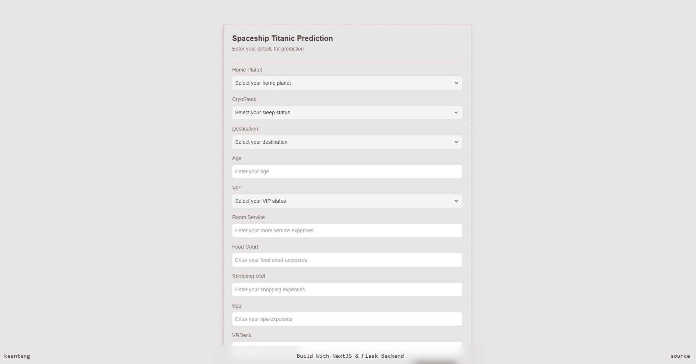

# NextJS + Flask Demo App


Tired of using Streamlit or Gradio to deploy your model for university assignment use case? This project provides an easy setup to deploy machine learning model trained on Python to a NextJS web interface with Flask serving as the backend. 

The good thing of using NextJS frontend is that the UI is completely customizable. With plenty of UI library out there in the web, your project will definitely stand out by adding more responsiveness and clean interface to navigate.

## Preview


## License


## Use This Repo

- Clone to local
```bash
git clone https://github.com/keanteng/nextjs-flask-demo
```

- Accesing frontend
```bash
npm run dev
```

- Accessing backend
```bash
cd backend
run app.py
```